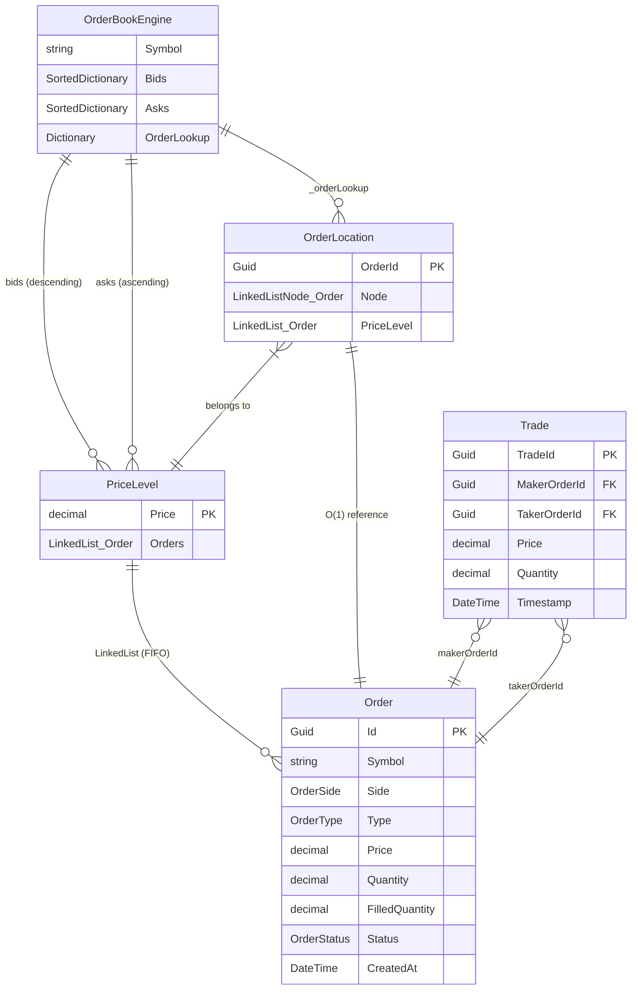

# ER Diagram



## 關係說明

  | 關係                         | 說明                                      |
  |------------------------------|-------------------------------------------|
  | OrderBookEngine → PriceLevel | 一個 OrderBook 有多個價格層級 (Bids/Asks) |
  | PriceLevel → Order           | 每個價格層級有多筆訂單 (FIFO LinkedList)  |
  | OrderLocation → Order        | O(1) 快速定位，用於取消訂單               |
  | Trade → Order                | 一筆成交關聯 Maker + Taker 兩筆訂單       |

##  視覺化資料流
```
  PlaceOrder(Buy@50000, qty=1.5)
             │
             ▼
      ┌─────────────────┐
      │ OrderBookEngine │
      ├─────────────────┤
      │ _asks (賣盤)     │ ← 嘗試撮合
      │  50100: [O1,O2] │
      │  50200: [O3]    │
      ├─────────────────┤
      │ _bids (買盤)     │ ← 未成交則掛單
      │  49900: [O4,O5] │
      │  49800: [O6]    │
      └─────────────────┘
             │
             ▼
      _orderLookup[OrderId] = OrderLocation
      (O(1) cancel 用)
```