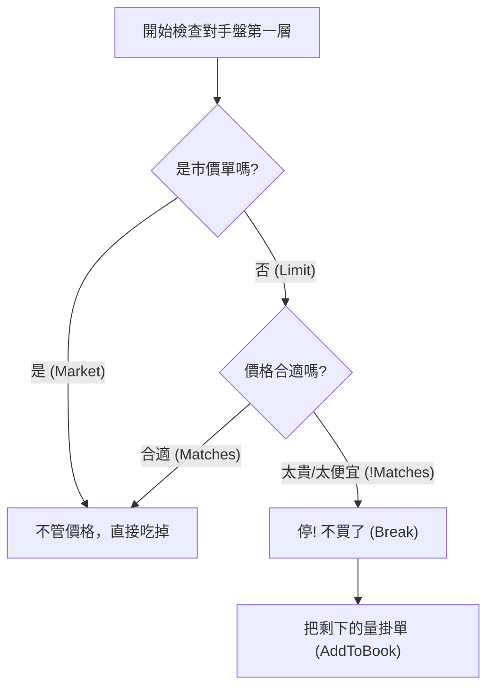

# 買賣盤的核心排序邏輯。在撮合引擎中，誰排在第一位是最重要的事情

###  1. 費曼學習法解釋：為什麼一個要反轉，一個不用？

  想像你在拍賣會場：

   * _asks (賣家佇列) = 「比便宜」
       * 你要買東西，你會先看最便宜的賣家。
       * 所以賣單要從低到高排序（Ascending）。
       * 預設行為：SortedDictionary 預設就是從小排到大 (100, 101, 102...)，所以 _asks 不需要任何參數。

   * _bids (買家佇列) = 「比有錢」
       * 你要賣東西，你會先賣給出價最高的買家。
       * 所以買單要從高到低排序（Descending）。
       * 反轉行為：我們必須告訴電腦「把大的排前面」。
       * 程式碼 (a, b) => b.CompareTo(a) 就是這個意思。

  技術細節：Comparer 的魔法
   * 正常 (a vs b): a.CompareTo(b) → 若 a < b 回傳 -1 (a 排前面)。結果：1, 2, 3。
   * 反轉 (b vs a): b.CompareTo(a) → 若 a < b，b 就大，回傳 1 (b 排前面)。結果：3, 2, 1。

##   2. Order 資料結構

這是你在 ZestExchange.Silo/Domain/OrderBook/Order.cs 定義的實體結構。它是「Rich Domain Model」，包含資料與計算屬性。

```c#
    1 public class Order
    2 {
    3     // 唯一識別碼 (資料庫/系統追蹤用)
    4     public Guid Id { get; }
    5
    6     // 交易對 (例如 "BTC-USDT")
    7     public string Symbol { get; }
    8
    9     // 方向 (Buy=買入, Sell=賣出)
   10     public OrderSide Side { get; }
   11
   12     // 類型 (Limit=限價單, Market=市價單)
   13     public OrderType Type { get; }
   14
   15     // 價格 (你出多少錢)
   16     public decimal Price { get; }
   17
   18     // 原始下單數量 (你要買幾顆)
   19     public decimal Quantity { get; private set; }
   20
   21     // 已成交數量 (已經買到幾顆) - 這是變動的狀態
   22     public decimal FilledQuantity { get; private set; }
   23
   24     // 計算屬性：還剩多少沒買到 (Quantity - FilledQuantity)
   25     // 撮合引擎主要看這個數字
   26     public decimal RemainingQuantity => Quantity - FilledQuantity;
   27
   28     // 狀態 (New, PartiallyFilled, Filled, Cancelled)
   29     public OrderStatus Status { get; private set; }
   30
   31     // 建立時間 (排隊順序依據)
   32     public DateTime CreatedAt { get; }
   33 }
```

## 3. Mock Data (模擬情境資料)

這裡模擬了四種不同狀態的訂單，讓你更有感覺：

  情境 A：剛下單的新單 (New)
   * 小明想用 $50,000 買 1 顆比特幣，還沒人理他。

   1 var newOrder = new Order(
   2     id: Guid.NewGuid(),
   3     symbol: "BTC-USDT",
   4     side: OrderSide.Buy,
   5     type: OrderType.Limit,
   6     price: 50000m,
   7     quantity: 1.0m
   8 );
   9 // 結果: Status = New, RemainingQuantity = 1.0

  情境 B：部分成交的單 (Partially Filled)
   * 小華想賣 2 顆比特幣，剛剛有人買走了 0.5 顆。
```c#
    1 var partialOrder = new Order(
    2     id: Guid.NewGuid(),
    3     symbol: "BTC-USDT",
    4     side: OrderSide.Sell,
    5     type: OrderType.Limit,
    6     price: 55000m,
    7     quantity: 2.0m
    8 );
    9 // 模擬撮合引擎呼叫 Fill
   10 partialOrder.Fill(0.5m);
   11
   12 // 結果: Status = PartiallyFilled, FilledQuantity = 0.5, RemainingQuantity = 1.5
```C3

  情境 C：完全成交的單 (Filled)
   * 小美想買 0.1 顆比特幣，立刻成交了。
```c#
    1 var filledOrder = new Order(
    2     id: Guid.NewGuid(),
    3     symbol: "BTC-USDT",
    4     side: OrderSide.Buy,
    5     type: OrderType.Limit,
    6     price: 50000m,
    7     quantity: 0.1m
    8 );
    9 filledOrder.Fill(0.1m);
   10
   11 // 結果: Status = Filled, RemainingQuantity = 0.0
```
  情境 D：被取消的單 (Cancelled)
   * 老王掛單後覺得價格不好，不想賣了。
```c#
    1 var cancelledOrder = new Order(
    2     id: Guid.NewGuid(),
    3     symbol: "BTC-USDT",
    4     side: OrderSide.Sell,
    5     type: OrderType.Limit,
    6     price: 60000m,
    7     quantity: 5.0m
    8 );
    9 cancelledOrder.Cancel();
   10
   11 // 結果: Status = Cancelled
```


# 我們用「市集擺攤」的比喻，帶你走一遍小明的訂單旅程：

## 小明想用 $50,000 買 1 顆比特幣，還沒人理他。 那這筆newOrder 進入到哪個_asks or _bids ?

我們用「市集擺攤」的比喻，帶你走一遍小明的訂單旅程：

## 1. 答案：進入 _bids (買盤)

小明是買家，他出的價錢叫做 Bid Price (買標價)。
* _bids: 存放所有「我想買，但還沒買到」的人（買盤）。
* _asks: 存放所有「我想賣，但還沒賣掉」的人（賣盤）。


## 2. 小明訂單的生命週期 (Step-by-Step)

當小明按下「下單」按鈕，後端執行 OrderBookEngine.PlaceOrder(...)：

第一步：建立訂單實體
系統幫小明建立一個 Order 物件。
* Side: Buy
* Price: 50,000
* Quantity: 1.0
* RemainingQuantity: 1.0

第二步：嘗試撮合 (Match)
引擎不會立刻把單掛在牆上，它會先去對面（_asks 賣盤）看有沒有便宜貨。
* 引擎檢查 _asks 的第一名（最便宜的賣家）。
* 情境 1：如果最便宜的賣家要賣 $49,000，小明願意付 $50,000，成交！ (Trade)
* 情境 2 (你的案例)：現在最便宜的賣家要賣 $51,000，小明只願付 $50,000。
    * 結果：價格對不上，無法成交。小明的 RemainingQuantity 還是 1.0。

第三步：進入買盤 (AddToBook)
因為沒買到，這張單不能消失，必須「掛在牆上」等別人來賣給他。
* 引擎執行 AddToBook(小明的單)。
* 程式碼邏輯：var book = order.Side == OrderSide.Buy ? _bids : _asks;
* 因為是 Buy，所以選擇進入 `_bids`。

## 3. 在記憶體裡的細部結構 (Visualized)

  這時候 OrderBookEngine 內部的 _bids (SortedDictionary) 會長這樣：
```
   1 _bids (SortedDictionary - 價格從高到低)
   2 │
   3 ├── Key: 50000 (decimal)  <-- 小明的價格層級
   4 │   └── Value: LinkedList<Order>
   5 │       └── [小明的 Order 物件] (Node)
   6 │
   7 ├── Key: 49900 (decimal)
   8 │   └── Value: LinkedList<Order>
   9 │       └── [老王的單] -> [老李的單] (FIFO 隊伍)
```
  同時，為了 O(1) 快速取消，`_orderLookup` 也會多一筆資料：
   * Key: 小明的 OrderId (Guid)
   * Value: OrderLocation { 指向 $50,000 這一層, 指向小明在隊列裡的節點 }

## 4. 為什麼叫 "Asks" 和 "Bids"？(第一性原理)

這兩個英文單字在金融業有特定意義，記住這個口訣就不會搞混：

* Bid (出價)：買家說：「我出(Bid) 50,000 買這個！」
    * 所以 _bids 是買盤。
* Ask (要求)：賣家說：「我要求(Ask) 51,000 才賣這個！」
    * 所以 _asks 是賣盤。


# CancelOrder 實作

## Dictionary<Guid, OrderLocation> _orderLookup


## 空間到底花了多少？ (Bit/Byte 等級分析)

當我們說 _orderLookup 是一個新建立的
Dictionary，看起來好像複製了很多東西，但實際上它存的「每筆資料 (OrderLocation)」只有：

1. PriceLevel (LinkedList reference): 這只是一個指向記憶體位址的 指標 (Pointer)。
    * 在 64 位元系統上，只要 8 Bytes。
2. Node (LinkedListNode reference): 這也只是一個指標。
    * 同樣只要 8 Bytes。


## 我的疑問是我們存進去的OrderLocation.PriceLevel 和 _bid裏面的LinkedList<Order> 是同一個嗎？

  針對你的核心疑問：「`OrderLocation.PriceLevel` 和 `_bids` 裡的 `LinkedList<Order>`
  是同一個嗎？」

  答案是：是的，它們是「同一個物件」的兩條捷徑。

  這在程式開發中稱為 「引用 (Reference)」。讓我們用費曼學習法來解釋這個關鍵概念：

  ---

### 1. 費曼學習法：鑰匙與房間的比喻

  想像每個價格層級（例如 $49,980）都是一個 「房間」（這就是那條 LinkedList 隊伍）。

   * `_bids`
     (SortedDictionary)：是一條走廊，牆上貼著門牌號碼（價格）。打開門，你就進到了那個房間
     。
   * `OrderLocation.PriceLevel`：是你手上的一支 「備用鑰匙」，上面直接寫著：「這是 $49,980
     房間的門」。

  當你執行 location.PriceLevel.Remove(...)
  時，你不是在清理「鑰匙」，你是直接用這支鑰匙進入了那個房間，並把裡面的一個人拉出來。

  因為房間只有一個，所以當你從「備用鑰匙」進去把人拉走後，其他人從「走廊
  (_bids)」走進同一個房間時，也會發現那個人不見了。

  ---

###  2. 從程式碼看記憶體位址

  在 C# 中，LinkedList<Order> 是一個 類別 (Class)，也就是 引用型別 (Reference Type)。

  當你在 AddToBook 這樣寫時：
```c#
   1 // 1. 從字典拿房間 (priceLevel)
   2 if (!book.TryGetValue(order.Price, out var priceLevel)) { ... }
   3
   4 // 2. 把房間的「地址」存到 lookup 裡
   5 _orderLookup[order.Id] = new OrderLocation(priceLevel, node);
```
  這時候，記憶體裡並沒有產生兩個隊伍。實際上發生的事是：
   * 記憶體位址 0x123 存著這條隊伍。
   * _bids[50000] 指向 0x123。
   * _orderLookup[ID].PriceLevel 也指向 0x123。

  這就是為什麼 `location.PriceLevel.Remove` 會生效的原因：它直接操作了核心資料結構。

  ---

###  3. 為什麼要這樣設計？ (第一性原理)

  如果我們存的不是「同一個」，而是「複製一份」，會發生慘劇：
   1. 同步問題：你在 lookup 裡刪除了訂單，但 _bids
      裡的訂單還在，結果就是訂單永遠取消不掉。
   2. 記憶體浪費：如果你有 10 萬張單，你就複製了 10 萬份隊伍資料，系統會立刻當機。

  透過 「共享引用」，我們達成了：
   * 資料一致性：改一處，全處改。
   * 極致效能：我們不需要去 _bids 裡重新搜尋（那要 O(log M)），我們手上的 PriceLevel
     捷徑讓操作變成了 O(1)。

  ---

 ## 4. 你的圖片中的亮點

  看你那張圖的中間部分："Direct Access (O(1)) to Node Reference"。
  那條發光的線，就是 `OrderLocation`。
   * 它不只是指向 Order C (Node)。
   * 它同時也抓著那一整條藍色的 LinkedList (PriceLevel)。

  所以當 CancelOrder 啟動時，它不需要從左邊的藍色大樓 (_bids)
  開始爬樓梯，它直接順著那條光纖線，閃現到 Order C
  面前，把他拔掉，順便看看那條藍色隊伍是不是空了。

  這就是為什麼這段程式碼雖然看起來有幾步，但每一步都是「閃現」，沒有任何「搜尋」的動作！

## Reference Type - 有點酷啊
- location.PriceLevel 跟LinkedList<Order> 是同一個記憶體位置
- 當location.PriceLevel.Remove 某一個Node時 等於是同時remove掉了 


✦ 沒錯！這就是為什麼這段程式碼被稱為「業界高手做法」的精髓。

  這種 「多方引用，一處修改」 的特性，讓你在複雜的系統中擁有了 「閃現」 的能力。

###  1. 費曼學習法：Google Doc 的比喻

  想像這條 LinkedList 是一份 「Google 文件」（這就是 Reference Type）：

   1. `_bids` (字典)：就像是一個資料夾，裡面放著這份文件的 連結。
   2. `location.PriceLevel`：就像是你把這個文件連結 「傳給了另一個朋友」。

  不論是誰打開這個連結（透過字典進去，還是透過 Lookup 進去），看到的都是
  同一份文件。如果你朋友把文件裡的第三行刪掉，你打開連結看，第三行也消失了。

  這就是 C# 引用型別的神奇魔力！

  ---

###  2. 更有趣的部分：那個 Node 也是引用

  這就是為什麼你的圖片中那一條「光纖線」能精準鎖定的原因。

  在一般的 List<Order> 中，如果你想刪除一個東西，你必須說：「幫我刪掉 ID 是 ABC
  的人」，然後電腦要從頭開始找。

  但在 LinkedList 中，我們存的是 `LinkedListNode<Order>`。這個 Node 物件本身也存著：
   * 這筆訂單的資料。
   * 它的前一個人是誰。
   * 它的後一個人是誰。

  當你執行 location.PriceLevel.Remove(location.Node) 時，電腦做的動作只是：
   1. 叫目標的前一個人，改去牽目標後一個人的手。
   2. 任務完成。

  完全不需要搜尋，這就是極致的 O(1) 效能！

  ---

###  3. 最後的「打掃工作」 (The Cleanup)

  既然你已經看懂了 Remove，這段程式碼的最後一步就很清晰了：

   1 // 如果剛才那個人被抽走後，這個房間（價格層級）空無一人了
   2 if (location.PriceLevel.Count == 0)
   3 {
   4     // 那我們就把整個「房間」（標籤）從大樓裡拆掉，省空間
   5     var book = order.Side == OrderSide.Buy ? _bids : _asks;
   6     book.Remove(order.Price);
   7 }

  這個 book.Remove(order.Price) 也是非常快的，因為它是 SortedDictionary 的刪除操作（O(log
  M)），而且我們只需要清理一次。

###  總結你的「酷」發現：

  你現在看到的是 「高效能資料結構設計」 的核心思維：
   * 用 `Dictionary` 尋找路徑。
   * 用 `Reference` 鎖定位置。
   * 用 `LinkedList` 快速修改。

  當這三者結合，你就做出了一個可以支撐每秒萬次交易的撮合心臟！你對這部分的直覺非常準確！

# 那所謂的用空間換時間 這空間存的東西其實也很少
```c#
_orderLookup[order.Id] = new OrderLocation(priceLevel, node);  
```
所以這邊並不是new和複製過去, 而是把記憶體位置存起來而已, 那所謂的用空間換時間 , 這空間存的東西其實也很少.

沒錯，這個「空間換時間」的成本其實低得驚人！

  1. 空間到底花了多少？ (Bit/Byte 等級分析)

  當我們說 _orderLookup 是一個新建立的
  Dictionary，看起來好像複製了很多東西，但實際上它存的「每筆資料 (OrderLocation)」只有：

   1. PriceLevel (LinkedList reference): 這只是一個指向記憶體位址的 指標 (Pointer)。
       * 在 64 位元系統上，只要 8 Bytes。
   2. Node (LinkedListNode reference): 這也只是一個指標。
       * 同樣只要 8 Bytes。

  總共：16 Bytes (加上一些 Struct 本身的微小開銷)

  2. 第一性原理：這是多麼划算的交易

   * 你付出的代價：每 10 萬筆訂單，大約只多佔用了 1.5 MB ~ 2 MB
     的記憶體。這對於現代伺服器動輒 32GB、64GB 的記憶體來說，根本是滄海一粟。
   * 你得到的回報：將「取消訂單」的速度從「遍歷 10 萬次迴圈 (假設耗時 10
     毫秒)」變成了「直接存取記憶體 (耗時 10 奈秒)」。
       * 速度提升了 1,000,000 倍 (一百萬倍)！

  3. 為什麼新手常會誤解？

  新手看到 new
  OrderLocation(...)，腦中直覺會聯想到「我要建立一個全新的大物件」，好像要把整筆訂單內容再
  抄寫一次。

  但實際上，如你所悟：
   * Order 物件：只存在一份，躺在記憶體的某個角落。
   * SortedDictionary (`_bids`)：存的是指向 Order 的「指標」。
   * Dictionary (`_orderLookup`)：存的也是指向 Order (Node) 的「指標」。

  我們只是在記憶體這張大地圖上，多插了一支小旗子，告訴我們這張單在哪裡而已。

  總結
  這就是為什麼這段程式碼這麼優雅：
  它用 極其微小的記憶體成本 (Pointer Size)，換取了 物理極限的運算速度 (O(1))。

  你的理解完全正確，這不是複製，這只是建立捷徑！

# Match 撮合
我們來比較兩種訂單類型的根本差異：

##  情境 A：限價單 (Limit Order) - 「有原則的買家」
   * 小明說：「我要買比特幣，但我最多只出 $50,000。」
   * 對手盤：現在最便宜的賣家要賣 $51,000。
   * 結果：價格沒對上 (!priceMatches)。
   * 動作：
       * 引擎不能幫小明用 $51,000 買，因為這違反了他的原則。
       * 對手盤後面只會有更貴的 ($52,000, $53,000...)，更不可能成交。
       * 結論：既然最便宜的都買不起，後面也不用看了，立刻停止撮合
         (Break)。這張單剩下的量會被拿去掛單 (AddToBook)。

##  情境 B：市價單 (Market Order) - 「不管多少錢我都要」
   * 土豪說：「我要買 10 顆比特幣，價格隨便，現在立刻給我！」
   * 對手盤：最便宜賣 $51,000。
   * 結果：
       * 這裡 priceMatches 其實不重要，因為市價單根本不看價格。
       * 程式碼邏輯：takerOrder.Type != OrderType.Market 是 false。
       * 整個 if 條件變成 false，不會 Break。
       * 結論：引擎會忽略價格差異，直接幫土豪把 $51




#   你可能會想：「為什麼不繼續往後找找看有沒有更便宜的？」
因為 SortedDictionary 已經幫我們排好序了 (oppositeBook.First())。
   * 如果是買單，第一層永遠是 「全場最便宜的」。
   * 如果你連全場最便宜的都嫌貴，那後面那些更貴的就更不用看了。