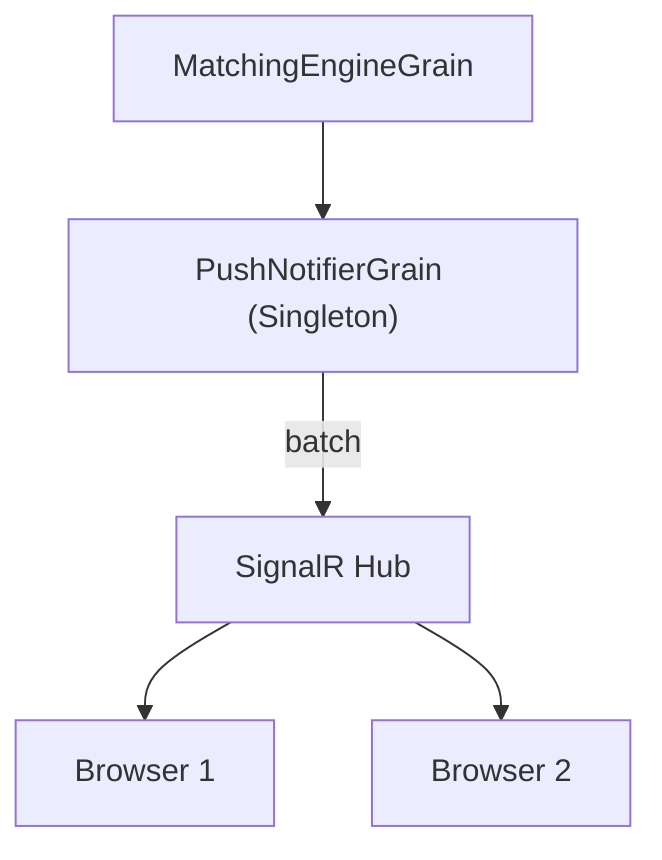

## Orleans Streams - SignalR

    SignalR 是 ASP.NET Core 內建的，不需要 Azure。
```
  | 環境       | SignalR                                  |
  |------------|------------------------------------------|
  | Local Dev  | ✅ 內建，直接用                          |
  | Production | Azure SignalR Service (可選，用於 scale) |

  ---
  ```
  Orleans Streams 架構

  你提到的 samples 很好！讓我解釋：
```
  ┌─────────────────────────────────────────────────────────────┐
  │                      Orleans Silo                            │
  │  ┌──────────────────┐      ┌──────────────────┐             │
  │  │MatchingEngine    │      │ PushNotifier     │             │
  │  │Grain (BTC-USDT)  │─────▶│ Grain            │             │
  │  │                  │ emit │ (SignalR Hub)    │             │
  │  │ OrderBookEngine  │ event│                  │             │
  │  └──────────────────┘      └────────┬─────────┘             │
  │                                     │                        │
  │         Orleans Stream              │ SignalR                │
  │         (Memory/Redis)              │ WebSocket              │
  └─────────────────────────────────────┼───────────────────────┘
                                        │
                                        ▼
                                ┌───────────────┐
                                │ Web (Blazor)  │
                                │ Real-time     │
                                │ OrderBook     │
                                └───────────────┘
```





  Orleans Streams vs Browser 連接

  Orleans Streams 不能直接連接 Browser - 這是對的！

  Orleans Streams 是 Server-side only 的 Pub/Sub 機制，運行在 Orleans Cluster 內部。

  ChatRoom Sample 的運作方式
```
  ┌─────────────────────────────────────────────────────────────┐
  │                    Server Side                               │
  │  ┌────────────┐    Orleans     ┌──────────────────┐         │
  │  │  Orleans   │    Stream      │  Blazor Server   │         │
  │  │   Grain    │ ───────────────▶  Component       │         │
  │  └────────────┘                │  (subscribes)    │         │
  │                                └────────┬─────────┘         │
  │                                         │                    │
  └─────────────────────────────────────────┼────────────────────┘
                                            │ SignalR (built-in)
                                            ▼
  ┌─────────────────────────────────────────────────────────────┐
  │                    Browser                                   │
  │  ┌──────────────────────────────────────┐                   │
  │  │  Blazor WASM/JS (receives UI update) │                   │
  │  └──────────────────────────────────────┘                   │
  └─────────────────────────────────────────────────────────────┘
```
  Blazor Server 的魔法：
  - Blazor Server Component 運行在 Server 上
  - 它可以直接訂閱 Orleans Stream（因為都在 Server）
  - 當收到 Stream 訊息 → 呼叫 StateHasChanged() → Blazor 自動透過 SignalR 推送 UI 差異到 Browser

  這就是為什麼 ChatRoom sample 看起來像是 Orleans Stream 直接到 Browser，但實際上中間有 Blazor Server 作為橋樑。

  ---
  現在讓我實作 ZestExchange 的即時 OrderBook！